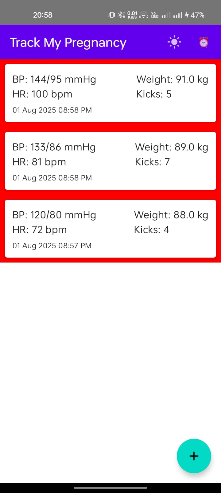
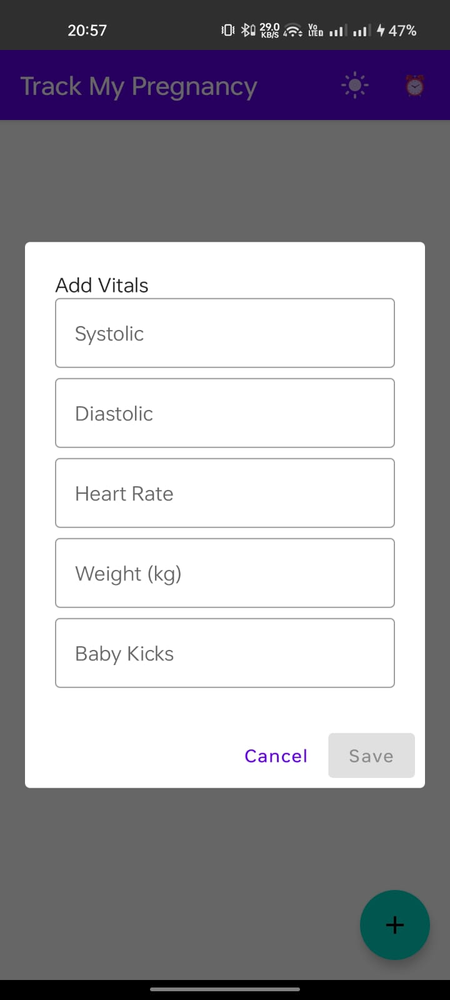
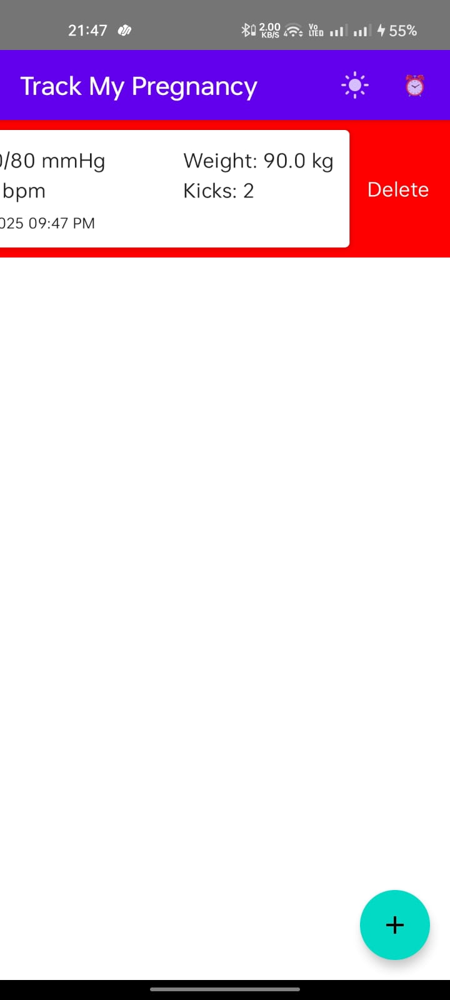

````markdown
# Pregnancy Vitals Tracker
An Android assignment given to me by Janitri and submitted as part of their recruitment/assessment process.

An **Android (Kotlin + Jetpack Compose)** app that lets expectant parents log blood-pressure, heart-rate, weight, and baby-kick counts, then reminds them every day at a custom time.

---

## ✨ Features

| Capability                  | Details                                                                                       |
|-----------------------------|-----------------------------------------------------------------------------------------------|
| **Add Vitals**              | Floating Action Button opens a form for BP, heart-rate, weight, baby-kicks.                   |
| **Set Notification Interval** | Custom **clock picker** lets users choose any hour & minute for daily reminders.               |
| **Delete Entry**            | Swipe left on any vitals card to remove the entry from the list and database.                  |
| **Daily Reminder**          | WorkManager fires a notification titled _“Time to log your vitals!”_ with a friendly prompt. |
| **MVVM + Room**             | Reactive StateFlow updates; data persists in local Room database.                             |
| **Jetpack Compose UI**      | Modern, declarative layouts with Material 3 components.                                        |
| **DataStore**               | Persists notification time & theme preferences across restarts.                                |

---

## 📸 Screenshots

| Main list                          | Add dialog                            | Set time picker                       | Delete                     |
|------------------------------------|---------------------------------------|---------------------------------------|----------------------------|
|  |  |  | |

---

## 🏗️ Tech Stack

| Layer      | Library                     | Notes                                              |
|------------|-----------------------------|----------------------------------------------------|
| UI         | Jetpack Compose 1.6.x       | Material 3 components                              |
| State      | Kotlin Coroutines + StateFlow | Reactive, thread-safe data flow                     |
| DB         | Room 2.6.x                  | DAO, Entities, Database singleton                  |
| Background | WorkManager 2.9.x           | Exact-time daily notifications                     |
| Storage    | DataStore 1.1.x             | Key-value preferences                              |
| DI         | Simple Factory              | Lightweight, no external DI libraries              |

---

## 🚀 Getting Started

1. Clone this repo:
   ```bash
   git clone https://github.com/yourusername/pregnancy-vitals-tracker.git
````

2. Open **Android Studio ≥ Iguana** → *Open an existing project*.
3. Let Gradle sync & build; Compose compiler handles Kotlin 2.x.
4. **Run** on an emulator or real device (API 24+).

---

## 🔧 Customising

| Task                      | File/Location                                          |
| ------------------------- | ------------------------------------------------------ |
| Notification text & title | `worker/ReminderWorker.kt`                             |
| Default reminder interval | `Prefs.reminderTime` fallback in `data/local/Prefs.kt` |
| UI colours & typography   | `ui/theme/Color.kt`, `ui/theme/Theme.kt`               |
| Database schema           | `data/local/VitalsEntity.kt`                           |

---

## 🗄️ Project Structure

```text
pregnancy-vitals-tracker/
 ├─ app/
 │   ├─ src/
 │   │   ├─ main/
 │   │   │   ├─ java/com/example/preg_vitals/
 │   │   │   │   ├─ data/
 │   │   │   │   │   ├─ local/
 │   │   │   │   │   │   ├─ Prefs.kt
 │   │   │   │   │   │   ├─ VitalsDao.kt
 │   │   │   │   │   │   ├─ VitalsDatabase.kt
 │   │   │   │   │   │   └─ VitalsEntity.kt
 │   │   │   │   │   └─ repository/
 │   │   │   │   │       └─ VitalsRepository.kt
 │   │   │   │   ├─ ui/
 │   │   │   │   │   ├─ components/
 │   │   │   │   │   │   ├─ AddVitalsDialog.kt
 │   │   │   │   │   │   └─ VitalsListItem.kt
 │   │   │   │   │   ├─ screens/
 │   │   │   │   │   │   ├─ ReminderScreen.kt
 │   │   │   │   │   │   └─ VitalsMainScreen.kt
 │   │   │   │   │   └─ theme/
 │   │   │   │   │       ├─ Color.kt
 │   │   │   │   │       ├─ Theme.kt
 │   │   │   │   │       └─ Type.kt
 │   │   │   │   ├─ viewmodel/
 │   │   │   │   │   ├─ VitalsViewModel.kt
 │   │   │   │   │   └─ VitalsViewModelFactory.kt
 │   │   │   │   ├─ worker/
 │   │   │   │   │   ├─ ReminderScheduler.kt
 │   │   │   │   │   └─ ReminderWorker.kt
 │   │   │   │   ├─ MainActivity.kt
 │   │   │   │   └─ PlaceholderScreen.kt
 │   │   │   ├─ AndroidManifest.xml
 │   │   │   └─ res/
 │   │   │       ├─ drawable/ic_notification.xml
 │   │   │       ├─ mipmap/
 │   │   │       └─ values/{colors.xml,strings.xml,themes.xml}
 │   │   └─ {test/,androidTest/}
 │   └─ build.gradle(.kts)
 ├─ .gitignore
 ├─ build.gradle(.kts)
 ├─ settings.gradle(.kts)
 ├─ README.md
 └─ docs/
     ├─ screenshot_main.png
     ├─ screenshot_dialog.png
     └─ screenshot_time.png
```

```
```
